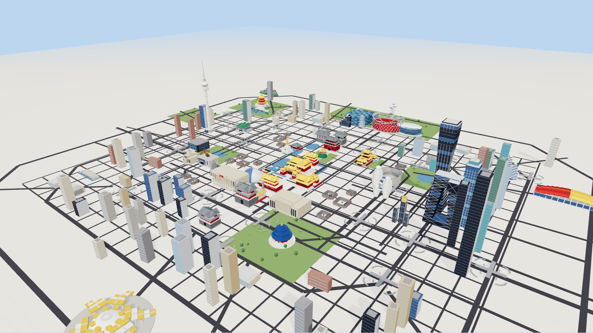

# 北京 · MuJoCo 微缩城市 (Beijing Mini-City)

An interactive 3D miniature of Beijing — **52 named landmarks**, a **100+ road
network** (ring roads 2–5环, named avenues, radial expressways and 24 clickable
立交桥 interchanges) plus procedural urban fabric (hutong courtyards, residential
& office blocks, lakes, parks) — placed at their real relative geographic
positions and rendered **live in the browser** by the official
**MuJoCo WebAssembly** module. Soft shadows, image-based lighting and a clean
map-style ground; fully **touch / mobile** friendly.

🔗 **Live:** https://fly-pigth.github.io/beijing-mujoco/

## What it is

The scene is a single MuJoCo MJCF model (`beijing.xml`, ~11,000 geoms). At load
time the page:

1. boots the official Google DeepMind MuJoCo WASM (`mujoco_wasm.js`),
2. compiles `beijing.xml` in-browser (`MjModel.loadFromXML`) and runs
   `mj_forward`,
3. reads every geom's world transform (`geom_xpos` / `geom_xmat`), shape
   (`geom_type` / `geom_size`) and colour (`mat_rgba`), and
4. draws them with **Three.js `InstancedMesh`** (one instanced draw per
   primitive — box / sphere+ellipsoid / cylinder+capsule), so 11k geoms stay
   smooth.

## Controls

- **Desktop:** drag — orbit · wheel — zoom · right-drag — pan
- **Mobile:** one finger — orbit · two fingers — pinch-zoom / pan
- **Click / tap a building or 立交桥** — show its name and a short introduction

## Landmarks (52)

中轴线 永定门·正阳门·天安门·午门·太和殿·神武门·角楼·景山·鼓楼·钟楼 ·
广场 人民大会堂·国家博物馆·国家大剧院·人民英雄纪念碑·毛主席纪念堂 ·
坛庙园林 天坛·太庙·社稷坛·北海白塔·雍和宫·孔庙·恭王府·天宁寺塔·德胜门 ·
郊野 佛香阁·十七孔桥·圆明园·八达岭长城·卢沟桥 ·
CBD CCTV·中国尊·国贸三期·银河SOHO·望京SOHO·银泰·凤凰中心·盘古 ·
奥林匹克 鸟巢·水立方·冰丝带·玲珑塔·奥林匹克塔·国家会议中心 ·
体育文化 工体·五棵松·首都博物馆·中华世纪坛·军博·国图 ·
西/远 中央电视塔·大兴机场·首都机场T3

## Files

| file | purpose |
|------|---------|
| `index.html` | UI shell + Three.js import map |
| `app.js` | MuJoCo-WASM loader + InstancedMesh renderer + picking |
| `mujoco_wasm.js` | official `mujoco-js` build (WASM embedded), Apache-2.0 |
| `beijing.xml` | the MuJoCo model (generated procedurally) |
| `names.json` | body-id → { name, intro } map (landmarks + interchanges) |

The model is generated by a separate Python toolchain (`bjlib.py` /
`generate_beijing.py` / `fabric.py` / `landmarks/`).

## Credits

- [MuJoCo](https://mujoco.org) & [`mujoco-js`](https://www.npmjs.com/package/mujoco-js) — Google DeepMind, Apache-2.0
- [Three.js](https://threejs.org) — MIT

Built with Claude Code.
